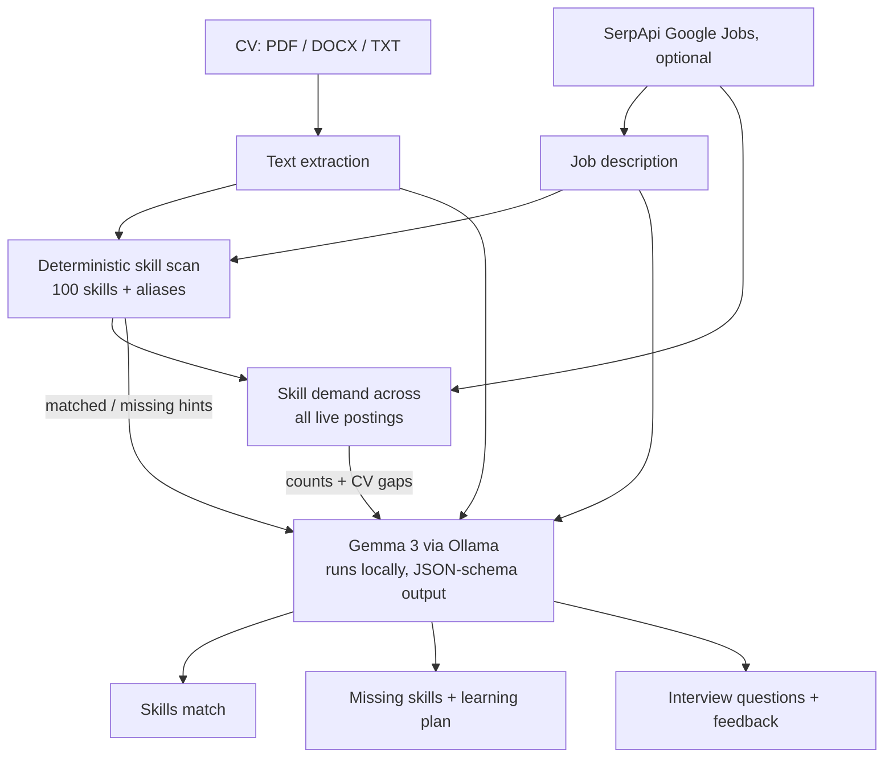

# JobPilot: Career Assistant for Sri Lankan Students

JobPilot is a private AI career coach for Sri Lankan
university students applying for internships and entry-level jobs. Upload your CV, paste a job
description, and ask:

- "What skills am I missing for this internship?"
- "Rewrite my project description."
- "What questions might they ask me?"
- "Compare my CV with this job description."

Everything runs on your own laptop with an open-weight **Gemma** model served by **Ollama**.
Your CV is never uploaded to a cloud AI service.

## Features

| Tab | What it does |
| --- | --- |
| Match & gaps | Instant keyword skill match, then Gemma's analysis: fit score, strengths with evidence quoted from the CV, missing skills ranked by importance with how to learn each, CV edits, and tailored interview questions |
| Rewrite | Turns a rough project description into a polished paragraph and action-verb CV bullets, using `[X%]` placeholders instead of invented numbers |
| Interview practice | Answer a question (one click from the generated list) and get a score, feedback, and a stronger answer that only uses facts from your CV |
| Ask JobPilot | Free-form chat grounded in your CV and the job description, streamed token by token |
| Find jobs | Live job postings via SerpApi (optional). Shows which skills employers are asking for across all the postings (green = on your CV, orange = not yet), ranks each posting by how well it matches your CV, and asks Gemma for a learning plan: the 3 most-requested skills you're missing, with a weekend-sized first step for each |

## Architecture



Only the search query goes to SerpApi. The CV is never sent: matching postings against it
happens locally.

The keyword scan is a reproducible baseline that is passed to the model as a hint, so a small
local model is grounded in what the CV actually says. Structured outputs (Ollama's JSON-schema
`format`) keep the responses parseable even from a 4B model.

## Why open matters here

- **Privacy:** a CV contains your name, phone number, address, and grades. With a local model none
  of that leaves your machine.
- **Cost:** students can use it as much as they want for free. No API key is needed for the core features.
- **Works offline:** CV analysis, rewriting, and interview practice work with no internet once the
  model is downloaded.
- **Swappable:** the **⚡ Fast mode** toggle switches between Gemma 3 4B and Gemma 3 1B per request.
  Set `OLLAMA_MODEL` to `gemma3:12b` on a stronger machine.

## Run it

Prerequisites: Python 3.11+ and [Ollama](https://ollama.com).

```bash
ollama pull gemma3:4b
ollama pull gemma3:1b         # for Fast mode

python3 -m venv .venv
source .venv/bin/activate
pip install -r requirements.txt
cp .env.example .env          # optionally add SERPAPI_KEY for live job search

uvicorn app.main:app --reload
```

Open http://localhost:8000. To try it quickly, paste `samples/sample_cv.txt` and
`samples/sample_job.txt`.

Measured on an 8 GB RAM laptop with no GPU, analysing the sample CV against the sample job:

| Model | Time | Quality |
| --- | --- | --- |
| `gemma3:4b` | ~4 min | Accurate gaps, evidence quoted from the CV |
| `gemma3:1b` (Fast mode) | ~1 min | Usable, but sometimes misreads the CV |

The keyword match appears instantly and chat answers stream as they are generated, so you are
never staring at a blank screen.

## Tests

```bash
python -m pytest
```

## License

MIT
